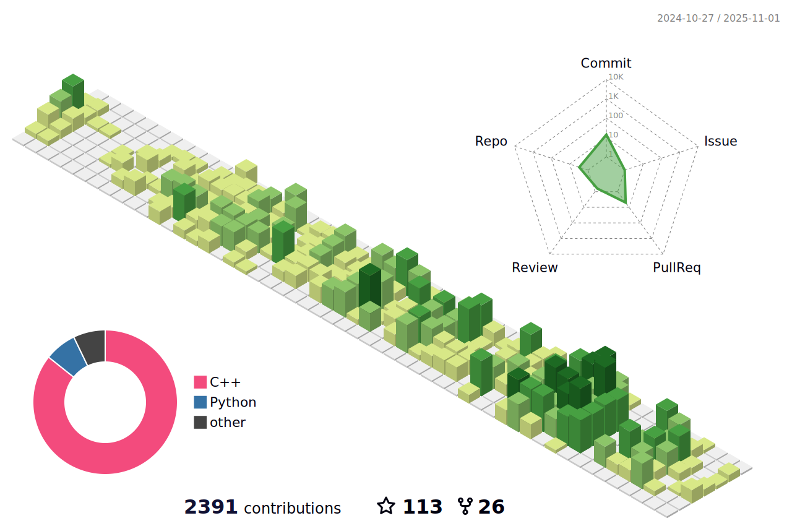

<!--  -->

Machine Learning | Experimental Design | Earth Sciences

### About

I am a PhD Fellow at Ghent University, Belgium. My research focuses on developing a new framework for experimental design in earth sciences under a Bayesian approach. I have experience in marine geophysical surveys, near-surface geophysics and coding. My research interests include Bayesian statistics, geostatistics, image processing, data science, and machine learning. I am interested in applying these methods to a variety of problems in environmental sciences and earth sciences.

Contact me if you want to discuss a project or collaborate on one involving the application of Machine Learning in the geosciences.

### Latest papers

* [A new framework for experimental design using Bayesian Evidential Learning: the case of wellhead protection area](https://www.sciencedirect.com/science/article/pii/S0022169421009537)
https://doi.org/10.1016/j.jhydrol.2021.126903
Linked repo: [skbel](https://github.com/robinthibaut/skbel)

* [A new workflow to incorporate prior information in minimum gradient support (MGS) inversion of electrical resistivity and induced polarization data](https://www.sciencedirect.com/science/article/pii/S0926985121000331#f0005).
https://doi.org/10.1016/j.jappgeo.2021.104286 Linked repo: [MGS-public](https://github.com/robinthibaut/MGS-public)

### Research
* [ResearchGate](https://www.researchgate.net/profile/Robin_Thibaut)
* [Publons](https://publons.com/researcher/4279492/robin-thibaut/)
* [orcid](https://orcid.org/0000-0001-7556-2700)

### Datasets

* [Wellhead Protection Area (protection zone) prediction using breakthrough curves](https://www.kaggle.com/datasets/robustus/whpa-prediction)

### Templates

* [Python scientific project](https://github.com/robinthibaut/project_template)

### Blog posts

* [A Gentle Introduction to Python with PyCharm](https://medium.com/@robin.thibaut/a-gentle-introduction-to-python-with-pycharm-367f6b73364a)

* [Principal Component Analysis from the ground up with Python](https://towardsdatascience.com/principal-component-analysis-from-the-ground-up-with-python-754399f88923)

* [The Importance of Python for Geoscientists](https://medium.com/@robin.thibaut/the-importance-of-python-for-geoscientists-28b68620ad45)

* [Why the Rainbow Color Map is Problematic](https://medium.com/@robin.thibaut/why-the-rainbow-color-map-is-problematic-23293d0937d5)

### Let's connect!

* [Kaggle](https://www.kaggle.com/robustus)

* [LinkedIn](https://www.linkedin.com/in/robin-thibaut/)

* [Twitter](https://twitter.com/RobinThibaut)

<!--  -->

<!--  -->
<!-- ###  -->

<!-- 
Example: add rendered image with html for more customization

Example: add rendered image when using config_display: columns

 -->
